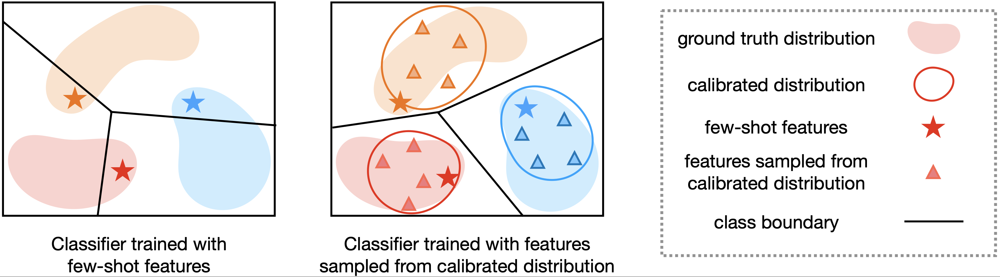

# [ICLR2021 Oral] Free Lunch for Few-Shot Learning: Distribution Calibration

paper link: https://openreview.net/forum?id=JWOiYxMG92s

zhihu link: https://zhuanlan.zhihu.com/p/344531704



## Backbone Training

We use the same backbone network and training strategies as 'S2M2_R'. Please refer to https://github.com/nupurkmr9/S2M2_fewshot for the backbone training.


## Extract and save features

After training the backbone as 'S2M2_R', extract features as below:

- Create an empty 'checkpoints' directory.

- Run:
```save_features
python save_plk.py --dataset [miniImagenet/CUB] 
```
### Or you can directly download the extracted features/pretrained models from the link:
https://drive.google.com/drive/folders/1IjqOYLRH0OwkMZo8Tp4EG02ltDppi61n?usp=sharing


After downloading the extracted features, please adjust your file path according to the code.


## Evaluate our distribution calibration

To evaluate our distribution calibration method, run:

```eval
python evaluate_DC.py
```

## Citation

If our paper is useful for your research, please cite our paper:

```
@inproceedings{
yang2021free,
title={Free Lunch for Few-shot Learning:  Distribution Calibration},
author={Yang, Shuo and Liu, Lu and Xu, Min},
booktitle={International Conference on Learning Representations (ICLR)},
year={2021},
}
```

## Reference

[Charting the Right Manifold: Manifold Mixup for Few-shot Learning](https://arxiv.org/pdf/1907.12087v3.pdf)

[https://github.com/nupurkmr9/S2M2_fewshot](https://github.com/nupurkmr9/S2M2_fewshot)

